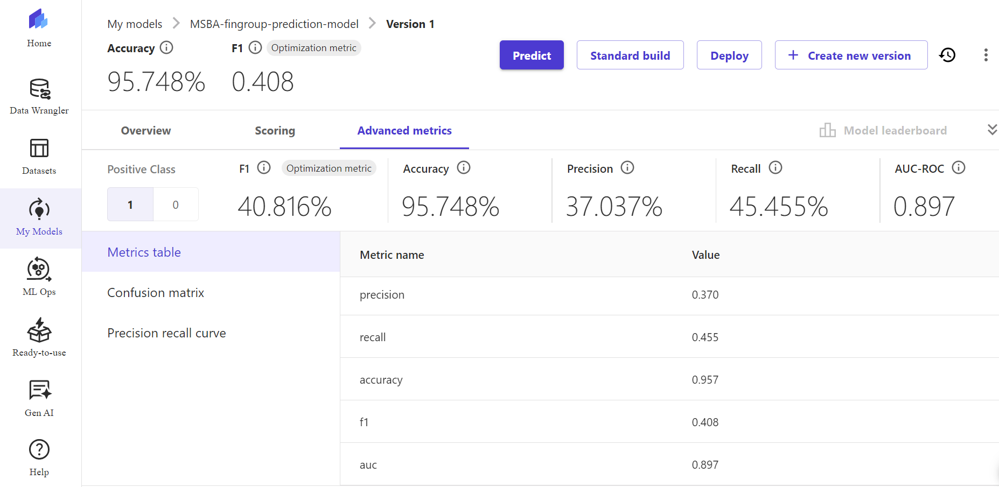
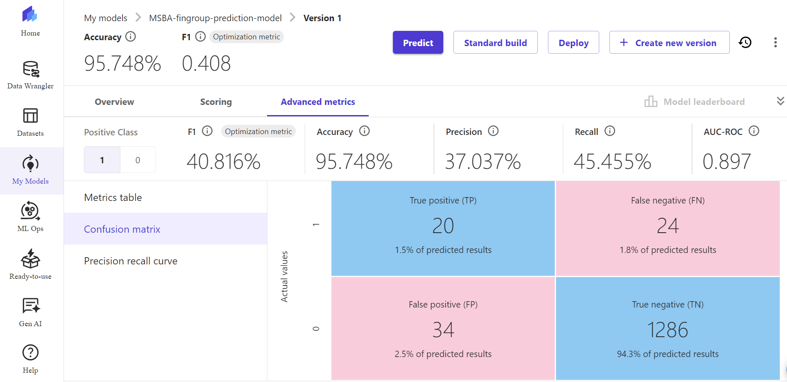
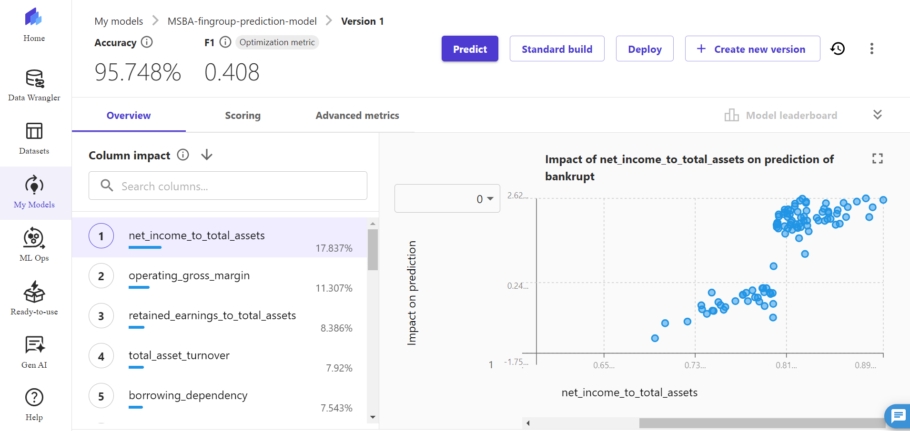
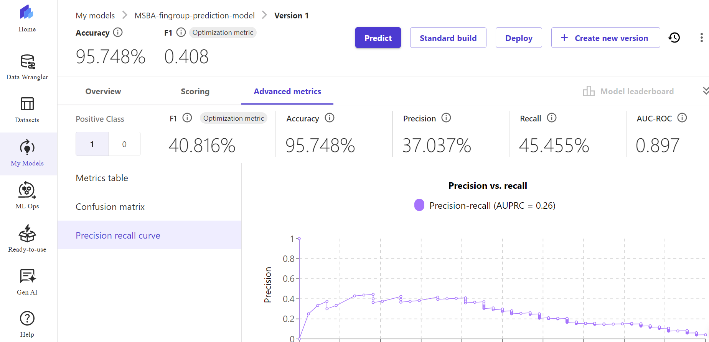
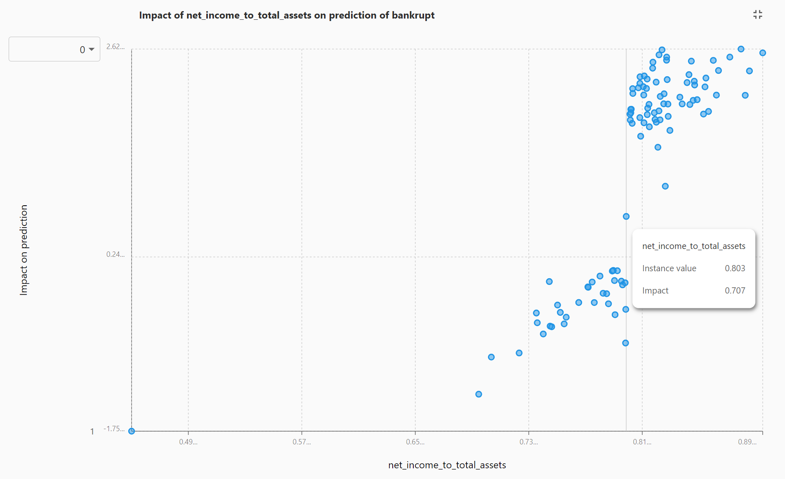

# Prototyping Cloud Architecture for Bankruptcy Prediction ☁️📊

This project demonstrates the design and implementation of a scalable, cloud-based data architecture using AWS services to predict bankruptcy risk using financial data. It integrates AWS S3 for data storage, AWS Glue for ETL processing, Amazon Redshift for data warehousing, and AWS SageMaker Canvas for machine learning model development and deployment.

---

## 📌 Project Summary

**Goal:**  
To build a robust cloud data architecture that enables end-to-end bankruptcy risk prediction. This architecture leverages AWS cloud services to facilitate data ingestion, transformation, storage, and advanced analytics.

**Key Features:**  
✅ AWS S3 Data Lake stores financial data (financial ratios, company profiles).  
✅ AWS Glue performs ETL to transform raw financial data.  
✅ Amazon Redshift hosts transformed data and enables scalable queries.  
✅ AWS SageMaker Canvas builds ML models achieving high accuracy (~95.75%).  
✅ Visual dashboards and advanced metrics (e.g., confusion matrix, feature impact) support model evaluation.

**Business Impact:**  
- Predict bankruptcy risk with high accuracy using financial data.  
- Identify key financial drivers influencing bankruptcy risk (e.g., net income to total assets, borrowing dependency).  
- Deliver insights to improve credit risk analysis, investment decisions, and portfolio management.

---

## 🛠️ Tools and Technologies

- **AWS S3:** Data Lake for storing raw and processed datasets.  
- **AWS Glue:** ETL pipeline for data transformation and integration.  
- **Amazon Redshift:** Data warehouse for analytics and querying.  
- **AWS SageMaker Canvas:** Machine Learning model development and deployment.  
- **Python (optional):** Exploratory Data Analysis (EDA) and preprocessing.  

---

## 🗂️ Repository Structure

- `Full_prediction.csv`: Model predictions and key metrics.  
- `Bankruptcy_Prediction.xlsx`: Supporting analysis and reports.  
- `Advanced Metrics.png`: Model evaluation metrics.  
- `Confusion Matrix.png`: Confusion matrix showing prediction results.  
- `Column Impact.png`: Top features influencing bankruptcy risk predictions.  
- `Precision Recall Curve.png`: Precision-recall performance.  
- `Impact of net income_to_total assets on prediction of bankrupt.png`: Feature impact visualization.  
- `Final Presentation.mp4`: Project demo video.  
- `Cloud Tech.pptx`: Project architecture and recommendations.  
- `Sandeep Cloud tech.docx`: Technical documentation.  
- `README.md`

---

## 🎥 Project Demo Video

To understand the end-to-end pipeline and model performance, watch the project presentation below:

📺 [Watch the Project Presentation](Final Presentation.mp4)  
*(Note: GitHub doesn’t support in-browser video playback—click to download or open in a new tab.)*

---

## 🖼️ Key Visualizations

### 📊 Advanced Metrics

### 📈 Confusion Matrix

### 🔎 Column Impact

### 📉 Precision Recall Curve

### 🧩 Impact of Net Income to Total Assets

---

## 🚀 Model Performance

- **Accuracy:** 95.75%  
- **Precision:** 37.04%  
- **Recall:** 45.45%  
- **AUC-ROC:** 0.897  

---

## 🔍 Key Insights

- **Net income to total assets** is a key driver in predicting bankruptcy risk.  
- Companies with higher borrowing dependency show increased bankruptcy likelihood.  
- Portfolio analysis highlights companies with stable financial indicators, such as Pharmasolve, Songster Inc, and Rogers & Sons, which exhibit lower bankruptcy risk.  

---

## 📈 Recommendations

- Focus investments on companies with strong net income to total assets ratios and stable earnings per share (EPS).  
- Monitor borrowing dependency as a risk factor.  
- Integrate risk dashboards using Redshift or Tableau for ongoing analysis.  

---

## 📝 Future Enhancements

- Deploy real-time scoring APIs using SageMaker endpoints.  
- Integrate visualization dashboards using AWS QuickSight.  
- Automate ETL pipelines and model retraining for continuous improvement.  

---

## 📬 Let’s Connect!

- **Email:** [sandeepkarumudi3@gmail.com](mailto:sandeepkarumudi3@gmail.com)  
- **LinkedIn:** [linkedin.com/in/sandeepk96](https://www.linkedin.com/in/sandeepk96)  
- **GitHub:** [github.com/sandeepk96](https://github.com/sandeepk96)  

Let’s collaborate on data-driven solutions that drive business value!
